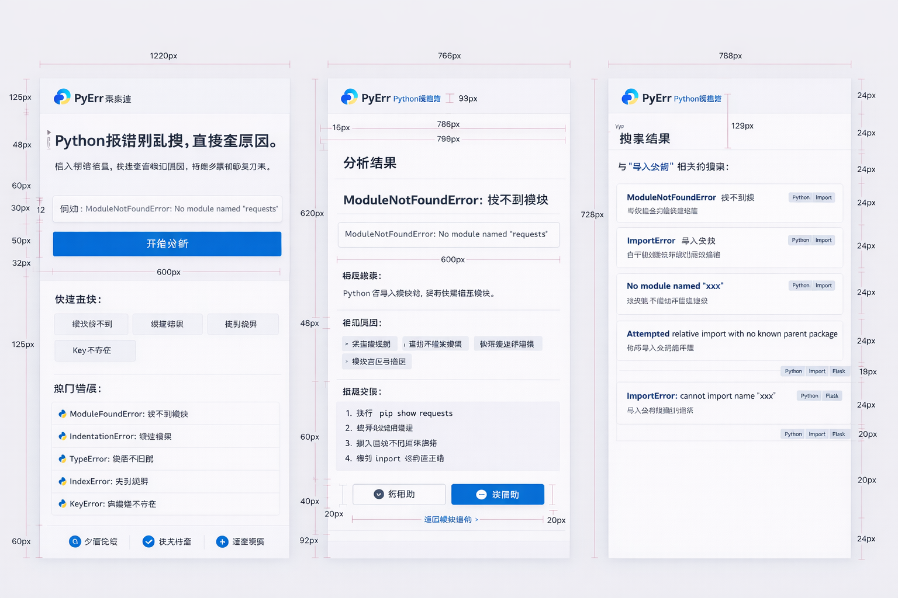

<div align="center">

# PyErr
### Python 纠错助手（Error Analyze + Search）


</div>

面向 Python 初学者的报错速查系统。输入报错信息后，系统会给出解释、常见原因、排查步骤和可执行修复建议。



## 功能模块

- 错误分析：`POST /api/analyze`
- 错误搜索：`GET /api/search`
- 热门错误：`GET /api/highlights`
- 反馈回流：`POST /api/feedback`
- 管理后台：规则管理与统计（登录保护）

## 技术架构

- 前端：Vue 3 + TypeScript + Vite
- 后端：FastAPI + SQLAlchemy
- 存储：SQLite
- 部署：Docker Compose（单机即可）

## 快速启动

### 1) 后端

```bash
cd backend
python -m venv .venv
.venv\Scripts\activate
pip install -r requirements.txt
python -m uvicorn app.main:app --reload
```

后端默认地址：`http://127.0.0.1:8000`

### 2) 前端

```bash
cd frontend
npm install
npm run dev
```

前端默认地址：`http://127.0.0.1:5173`

## Docker 部署

```bash
cp .env.server.example .env
docker compose up -d --build
```

详细参数见 [DEPLOY.md](./DEPLOY.md)。

## 管理员默认账号

- 用户名：`admin`
- 密码：`admin123456`

可通过环境变量覆盖：

- `PYERR_ADMIN_USERNAME`
- `PYERR_ADMIN_PASSWORD`
- `PYERR_TOKEN_SECRET`
- `PYERR_TOKEN_EXPIRE_SECONDS`

